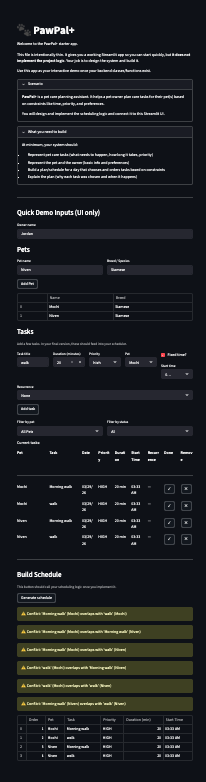

# PawPal+ (Module 2 Project)

You are building **PawPal+**, a Streamlit app that helps a pet owner plan care tasks for their pet.

## Scenario

A busy pet owner needs help staying consistent with pet care. They want an assistant that can:

- Track pet care tasks (walks, feeding, meds, enrichment, grooming, etc.)
- Consider constraints (time available, priority, owner preferences)
- Produce a daily plan and explain why it chose that plan

Your job is to design the system first (UML), then implement the logic in Python, then connect it to the Streamlit UI.

## What you will build

Your final app should:

- Let a user enter basic owner + pet info
- Let a user add/edit tasks (duration + priority at minimum)
- Generate a daily schedule/plan based on constraints and priorities
- Display the plan clearly (and ideally explain the reasoning)
- Include tests for the most important scheduling behaviors

## Smarter Scheduling

Beyond the core scheduler, the following features were added to make task planning more realistic and useful:

- **Fixed vs. flexible tasks** — Tasks can optionally have a `start_time`. Fixed-time tasks (e.g. vet appointments, grooming) are anchored chronologically at the top of the schedule. Flexible tasks (e.g. walks, medication) follow, sorted by priority then duration.

- **Task filtering** — The task list can be filtered by pet or completion status (All / Incomplete / Completed), making it easy to focus on what still needs to be done for a specific pet.

- **Recurring tasks** — Tasks can be marked as `daily` or `weekly`. When a recurring task is marked complete, a new instance is automatically created for the next occurrence with the date advanced by the appropriate interval.

- **Conflict detection** — After generating a schedule, the scheduler checks all fixed-time tasks for overlapping time windows. Any conflicts are surfaced as warnings rather than errors, so the schedule is still shown and the user can decide how to resolve them.

## Demo



## Getting started

### Setup

```bash
python -m venv .venv
source .venv/bin/activate  # Windows: .venv\Scripts\activate
pip install -r requirements.txt
```

### Suggested workflow

1. Read the scenario carefully and identify requirements and edge cases.
2. Draft a UML diagram (classes, attributes, methods, relationships).
3. Convert UML into Python class stubs (no logic yet).
4. Implement scheduling logic in small increments.
5. Add tests to verify key behaviors.
6. Connect your logic to the Streamlit UI in `app.py`.
7. Refine UML so it matches what you actually built.

## Testing PawPal+

Run the full test suite with:

```bash
python -m pytest tests/test_pawpal.py
```

### What's covered

| Test | Description |
|---|---|
| `test_mark_complete_changes_status` | Verifies `mark_complete()` sets `completed = True` and returns `None` for non-recurring tasks |
| `test_add_task_increases_pet_task_count` | Verifies `add_task()` correctly appends a task to a pet's task list |
| `test_schedule_fixed_time_tasks_appear_before_flexible` | Verifies fixed-time tasks always appear before flexible tasks in the schedule, regardless of priority |
| `test_schedule_fixed_tasks_ordered_by_start_time` | Verifies multiple fixed-time tasks are sorted chronologically |
| `test_filter_tasks_by_pet` | Verifies `get_tasks_by_pet()` returns only tasks belonging to the specified pet |
| `test_filter_tasks_by_status` | Verifies `get_tasks_by_status()` correctly separates completed and incomplete tasks |
| `test_mark_complete_daily_returns_next_occurrence` | Verifies completing a daily task produces a new task dated one day later |
| `test_mark_complete_weekly_returns_next_occurrence` | Verifies completing a weekly task produces a new task dated one week later |
| `test_detect_conflicts_same_start_time` | Verifies the scheduler flags two overlapping fixed-time tasks as a conflict |
| `test_no_conflicts_non_overlapping_tasks` | Verifies non-overlapping tasks produce no conflict warnings |

### Confidence level

★★★★☆ (4/5)

All 10 tests pass. Core scheduling logic, filtering, recurrence, and conflict detection are well covered. The remaining gap is UI-level behavior (e.g. Streamlit interactions) and edge cases such as tasks that span midnight or recurring tasks with an end date, which are not yet tested.
